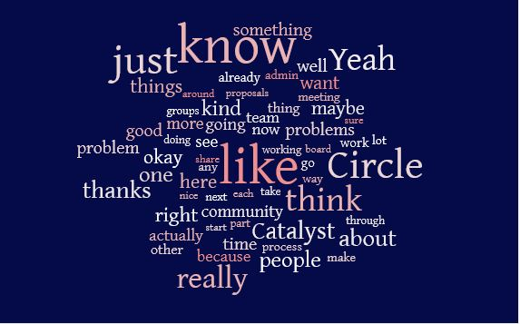

# Meeting 1 - November 11th, 2021

## Meeting Recording


Catalyst Circle V2 Meeting #1


## Minutes of Catalyst Circle V2 Meeting #1

### **Present**

**CCv1: **Victor Corcino, Felix Weber, Lauris, Dor Garbash, Juliane Montag                                                                                                                                                                                                                                                                                                                                                                                                                                                                                                                                                                                                                                                                                                                                                                                                                                                                                                                                                                                                                                                                                                                                                                                                                                                                                                                                                                                                                                                                                                                                                                                                                                                                                                                                                                                                                                                                                                                                                                                                                                                                                                                                                                                                                                                                                                                                                                                                                                                                                                                                                                                                                                                                                                                                                                                                                                                                                                                                                                                                                                                                                                                                                                                                                                                                                                                                                                                                                                                                                                                                                                                                                                                                                                                                                                                                                                                                                                                                                                                                                                                                                                                                                                                                                                                                                                                                                                                                                                                                                                                                                                                                                                                                                                                                                                                                                                                                                                                                                                                                                                                                                                                                                                                                                                                                                                                                                                                                                                                                                                                                                                                                                                                                                                                                                                                                                                                                                                                                                                                                                                                                                                                                                                                                                                                                                                                                                                                                                                                                                                                                                                                                                                                                                                                                                                                                                                                                                                                                                                                                                                                                                                                                                                                                                                                                                                                                                                                                                                                                                                                                                                                                                                                                                                                                                                                                                                                                                                                                                                                                                                                                                                                                                                                                                                                                                                                                                                                                                                                                                                                                                                                                                                                                                                                                                                                                                                                                                                                                                                                                                                                                                                                                                                                                                                                                                                                                                                                                                                                                                                                                                                                                                                                                                                                                                                                                                                                                                                                                                                                                                                                                                              **CCv2: **Harris Warren, Tevo Saks, Raymond Mata, Matthias Sieber, Kenric Nelson, Stephen Whitenstall, Allison Fromm

**CC Admin team: **Nadim Karam, Nori Nishigaya, JP, Michael Yagi, Peter Wolcott

### **Speaker percentages**

Dor (26%), Nori (21%), Tevo (7%), Stephen (7%), Victor (6%), Lauris (5%), Felix (4%), Juliane (4%), Matthias (3%), Raymond (3%), Kenric (3%), Harris (3%), Allison (3%), Michael (3%), JP (1%), Peter (1%), Nadim (1%)

### 1) Welcome & Introductions

**Dor  (2:05) **My name is Dor; I'm the head of product governance of IOG, former Circle member, and now a mentor for Harris.

**Felix  (2:35) **I’m Felix. Former representative for the Toolmakers and Maintainers, and now happy to support Tevo in Catalyst Circle version 2.

**Lauris  (2:56)  **I’m Lauris, I used to be here representing SPOs. Now mentoring Raymond.

**Victor  (3:32) **My name is Victor. I was the Community Advisors’ representative in Circle v1, and I'm here to support Kenric as the representative in circle v2.

**JP  (3:58) **JP here. I've been lurking around Catalyst for a while, and I am on the admin team.

**Michael  (4:20) **I'm Michael; I'm part of the admin team as a secretary; I'm very involved in Cardano itself ; I’m CEO of a Cardano startup called [Ikigai Technologies](https://ikigaitech.org).

**Nadim  (4:45) **My name is Nadim Karam; I come from a digital transformation background and I've been with the admin team for a month now.

**Peter  (5:05) **I joined Project Catalyst in the summer;  then I came on board as a secretary when CCv1 (Catalyst Circle version 1) one asked for them.

**Nori  (5:26) **My name is Nori Nishigaya, I'm on the admin team, I'm the current facilitator for the Circle.

**Raymond  (5:48) **I'm Ray; I'm the stakepool operator for [GROW](https://growpools.io); I'm also a founding board member for [SPOCRA](https://members.spocra.io/feed). I'm going to be taking over for Lauris.

**Kenric (6:14) **I'm Kenric. I run a small business called [Photrek](https://photrek.world). And one of the first activities of the business was to run ITN stakepool. I'm part of the admin team.

**Stephen (6:59) **I'm Stephen, I run a project called [Quality Assurance DAO](https://quality-assurance-dao.github.io), and I've been with Project Catalyst since March. I'm the Catalyst Coordinator representative for version 2, replacing Juli Montag.

**Allison  (7:27) **I'm Allison, representing the general ADA voters. I've been around Catalyst since Fund Zero.

**Harris  (7:56) **I'm super excited to be here with Catalyst Circle.

**Matthias  (8:25) **My name is Matthias Sieber, preferred pronouns he/him. I'm the representative for the Cardano Foundation, but I can only bring myself to the Circle today, as I have limited information on the Foundation's expectations regarding this endeavour, at least at this time.

**Tevo  (8:53) **I’m Tevo, from Estonia. I was funded in Fund 1, and been actively participating since then. I represent Toolmakers and Maintainers in CCv2.

## 2) Introduction** to the Circle**

### **General introduction (Victor, 12:13)**

* You are here representing your own groups, but you don't need to  defend their interests against other groups. It’s collaborative.
* Don’t have to do everything by yourself. You’re here to lead, coordinate, and inspire your groups, and to build bridges.
* It's a big responsibility, but it's also an experiment. As in Catalyst overall, things may break. Don't be afraid of changing things.

### **Problem-sensing best practices (18:13)**

Approaches used by CCv1 to problem-sense with their communities:

* Telegram
* Miro boards
* Using voting to rank problems
* Live sessions and interactivity
* After Town Hall and Swarm sessions
* CCv2 can use the problem-sensing backlog created by CCv1; but they do not have to.
* Use and talk to your community
* If you feel you don’t know how to facilitate a problem sensing session, you can learn from others in Circle. This is a safe space to be real about what you feel comfortable & confident about.

### **Processes explanation  (38:16)**

* New CC Slack channel: will be primary communication channel outside meetings for CCv2, Admin team, and CCv1 alumni (agenda planning, Fund 7 proposals discussion, etc.)
* Slack integrations are available – not free, but there is budget if it’s desired.&#x20;
* Currently using Trello to track problem-sensing, tho this can change if people want. <mark style="color:red;">ACTION ITEM: To be discussed at future CCv2 meeting</mark>.
* GitBook documentation of meetings will continue to be done by QA-DAO. Access to video recordings and minutes needed.
* Website in progress for high-level learning about Catalyst Circle and links to public documentation; some of the GitBook info might also be there
* Catalyst Circle email addresses will be set up.
  * Instead of name, use role so it's transferable to CCv3
* Michael is setting up Confluence for Admin team documentation. They also use Jira (40:45)
* Tevo might use Miroboards to e.g. share results from problem-sensing, but not to document CC meetings
* <mark style="color:red;">**ACTION ITEM:**</mark> <mark style="color:red;">Admin Team to add Daniel Ribar to Slack, then retire CC Telegram</mark>&#x20;
* **Prototyping  (Dor, 49:22)** Catalyst is a prototype of Voltaire governance. Look for the best tools and techniques, experiment with them in Circle, and if they work, they could become part of Cardano’s canon of governance methodologies.
* **Accessibility (Stephen, 52:03)** – Good to experiment with tools – but need to make it accessible. Sometimes proprietary tools are inaccessible.
* **Processes  and tools for communicating the work of Circle:** (52:53)
  * SPOCRA uses public meetings
  * one-to-one discussions with key people
  * CAs use Telegram, and find it better than Discord
  * reaching General Voters is harder; Voter Surveys (incentivised and non-incentivised) might help.
    * <mark style="color:red;">**ACTION ITEM**</mark><mark style="color:red;">: share and discuss voter surveys from funds 1-5 at a future CCv2 meeting.</mark>

## **3) Trello board handover (1:01:02) **[_Trello_](https://trello.com/b/DRBO6qyF/catalyst-prioritized-problems)[_ _](https://trello.com/b/DRBO6qyF/catalyst-prioritized-problems)[_Board_](https://trello.com/b/DRBO6qyF/catalyst-prioritized-problems)

### **Trello board structure** **(Dor, 1:02:43**)

Th_e_ columns are:

* problem backlog
* raw problems (NB tickets need an owner)
* well defined problems
* Shared with Community
* Picked Up (Circle can take direct ownership, or community members can. There can be more than one group working on a problem).
* Protoyping  (when an actual prototype of a solution is produced by those working on it). From here, it can move to either
  * “validation”, if the prototype solution is successful; and then “integrated”, when the solution becomes fully integrated into the Catalyst process
  * “rejected”,  if the prototype solution is unsuccessful

### **Approaches to Trello **

* Can we split tasks into subtasks? **(Tevo 1:11:27)**
* Some problems might be too specific, others too broad – CCv2 might want to discuss this during their problem-sensing (**Victor 1:14:06) **
* Jira might be a better tool than Trello – but if we move to Jira, need a project manager. Decision: Split the Secretary role into Secretary and PM
* Tools we use need to be public facing (**Harris  1:17:19) **
* We should move to open-source tools, not proprietary (**Stephen 1:18:02)**
* <mark style="color:red;">**DECISION**</mark><mark style="color:red;">: discuss in a future meeting moving to public-facing and open-source tools</mark>
* Trello cards should be moved within meetings only
* CCv2 should make a fresh start at defining problems – but if a problem identified by CCv1 still resonates, keep it on the board **Dor  1:20:31 **
* Mentors can help give background info on existing cards **Juliane 1:23:06**
* <mark style="color:red;">**DECISION**</mark> <mark style="color:red;">– review the board in CCv2’s next meting and decide which cards to keep</mark>
* Perhaps named owners of Trello cards should be the role, not the name of the individual? Undecided – person’s name might be useful for emphasis
* More than one name can “own” a card
* CCv1 members who are still engaged with a problem can continue to be involved; they should liaise with their CCv2 counterpart
* <mark style="color:red;">**ACTION ITEM: **</mark><mark style="color:red;">Admin team to invite CCv2 to the Trello board</mark>

## **4) CCv2 initial 30-day plan (1:27:27)**

### Proposals deadline

* Fund 7 deadline is approaching: urgency to prepare CC proposals
* This time, Admin team has prepared them – CCv2 will finalise.
* In future, outgoing CC team will prepare proposals to hand over to next CC team. CCv2 will do this for CCv3.

### CCv2 individual plans

Each CCv2 member in turn outlines their initial ideas for next 30 days.

* **Stephen (1:32:30) :** has set up a GitHub and GitBook for the Catalyst Coordinators, to create an infrastructure for problem-sensing, document the funded process, and store information to advise funded proposers. Toolmakers might collaborate on this - it may turn into a Fund 7 funding proposal. Also will focus on auditability.
* **Allison (1:35:49)  **: interested in reaching communities that aren't engaged, maybe because of language barriers: Spanish breakout room, Eastern Town Hall. Invites input on channels or communities that are not otherwise engaged with Catalyst that I should connect to.
* **Kenric (1:36:47)  **: will focus on 2 items already on the Trello board which he is interested in and has discussed in Swarm sessions.
* **Matthias (1:37:18) **: is trying to get input from the Cardano Foundation leadership beyond what's publicly available. Will incorporate the ambassadors’ guild group. Mentorship: Felix and Victor.
* **Harris (1:38:49)  **: will initiate sharing the analysis of feedback from Catalyst members, voter surveys, etc. Will take input from IOG itself and internal stakeholders, to see if there's problems that might be addressed here by the Circle.
* **Raymond (1:39:21)  **: wants to find ways to inform stakepool operators on how to get involved with Catalyst, e.g. as CAs. Wants to build problem-sensing tools suitable for such a large, diverse and multilingual community.
* **Tevo (1:40:49) **: after next weekend, will hold a session for Toolmakers about sense-making, using a sense-making Miro board. Also wants to improve the onboarding process for CCv3.

### **Scope **

**(Dor 1:42:30) **It’s tempting to go beyond the scope of Catalyst, to the entire Cardano ecosystem; but we're not very well resourced to deal with such issues from here. So frame problem-sensing exercises as problems with Catalyst, to get problems we can actually address from within Circle.

## 5) Meeting feedback (1:46:36)

(**Nori  1:46:36)  **Normally we fill out the feedback form in the meeting, but today I want to get some closing comments from everybody verbally. Feedback form completion is “homework” . Feedback Form: [https](https://forms.gle/Jp8UXoqP4ggFijjS8)[://](https://forms.gle/Jp8UXoqP4ggFijjS8)[forms](https://forms.gle/Jp8UXoqP4ggFijjS8)[.](https://forms.gle/Jp8UXoqP4ggFijjS8)[gle](https://forms.gle/Jp8UXoqP4ggFijjS8)[/](https://forms.gle/Jp8UXoqP4ggFijjS8)[Jp](https://forms.gle/Jp8UXoqP4ggFijjS8)[8](https://forms.gle/Jp8UXoqP4ggFijjS8)[UXoqP](https://forms.gle/Jp8UXoqP4ggFijjS8)[4](https://forms.gle/Jp8UXoqP4ggFijjS8)[ggFijjS](https://forms.gle/Jp8UXoqP4ggFijjS8)[8](https://forms.gle/Jp8UXoqP4ggFijjS8)&#x20;

### **Closing remarks from everyone in turn:**

* CCv2 - happy, excited and a little nervous
* CCv1 - happy, and a little emotional to be leaving;
* All - offer thanks & appreciation to their own team, the other team, and the CC Admin team

### Closing speech

(**Dor  1:59:21) **Closing speech comparing CC to giving birth, and praising the concept of leadership&#x20;

## Key words from this meeting

**The most common words used in this meeting were:** &#x20;

